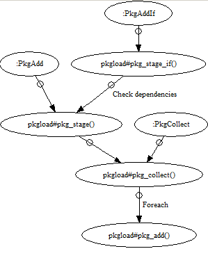

Pkgload
=======

* [Introduction](#introduction)
  + [What is it?](#what-is-it)
  + [Why should I use it?](#why-should-i-use-it)
  + [Differences with Pathogen](#differences-with-pathogen)
* [Usage](#usage)
  + [Example vimrc](#example-vimrc)
  + [Usage alongisde a plugin manager](#usage-alongisde-a-plugin-manager)
* [Installation](#installation)
* [How it works](#how-it-works)
* [Reference](#reference)
  + [Commands](#commands)
  + [Options](#options)
  + [Functions](#functions)
  + [Internals](#internals)
* [License](#license)
* [Todos](#todos)

Introduction
------------

### What is it?

This is a plugin loader. It is **_not_** a plugin manager. It does not download
or install plugins. It just helps you load them. It is very similar to
[Pathogen](https://github.com/tpope/vim-pathogen). See next section for a
comparison.

In fact, Pkgload is mostly a wrapper around `:packadd`, a command that was added
in Vim 8 and in recent releases of Neovim. Pkgload adds some convenience
utilities and affords precise control over package loading without bloating your
configuration files. This makes it easier to manage large numbers of plugins.
I believe Pkgload provides enough control that it can be used to incorporate
external Vim plugins in Vim development work, and it is itself simple
enough to be included in an external package repository.

Pkgload is fundamentally different from the various package managers available
for Vim nowadays. In fact, I strongly recommend that you use a plugin manager in
conjunction with Pkgload. There are several high-quality options available,
including [Vundle](https://github.com/VundleVim/Vundle.vim),
[Plug](https://github.com/junegunn/vim-plug),
[Dein](https://github.com/Shougo/dein.vim),
[VAM](https://github.com/MarcWeber/vim-addon-manager), and
[Flavor](https://relishapp.com/kana/vim-flavor). See [Usage](#usage) for
instructions on using these programs together.

### Why should I use it?

You should use Pkgload if:
- You do not like to mix "loading" and "installation".
- You want to exercise control over what you load and when you load it.
- You want to be able to programmatically examine packages that have
  been loaded.
- You want to be able to reload packages on-the-fly without reloading
  your initialization file or restarting Vim.
- You are already comfortable with a Vim plugin manager, or you do not
  mind installing and upgrading lots of plugins by hand.
- You are a Pathogen user and you are curious.
- You are a plugin developer or just a perfectionist Vim hacker, and you
  want an easy way to load plugins dynamically.

You should not use Pkgload if:
- You like the fact that most plugin managers also load plugins for you.
- You don't use a lot of plugins.
- You don't want to have to manage plugins separately, and/or your don't
  want to use or learn a second piece of software for plugin management.

### Differences with Pathogen

**Pkgload**:
- Plugins must be explicitly marked for loading with `:PkgAdd`.
- Plugins are loaded explicitly and individually with `:PkgCollect` at any time.
- Plugins are loaded from `pack/*/opt/`, but this can be changed by setting
  `'packpath'`. Plugins placed under `pack/*/start` are loaded automatically by
  Vim (see `:help plugins`).
- Pkgload is designed to give the user fine control over which plugins are loaded
  and when they are loaded.
- Pkgload is brand new and only works on Vim 8 or recent versions of Neovim.
- I have very little open-source "cred". I am just a guy who likes Neovim.

**Pathogen**:
- Plugins are loaded implicitly unless blacklisted.
- Plugins are loaded explicitly with `pathogen#infect()` at any time, but only
  all together. It is cumbersome to swap packages in and out of the blacklist
  in order to reload them individually.
- Plugins are loaded from `bundle/` and `pack/*/start/` by default, but this
  can be changed by passing a different path to `pathogen#infect()`.
- Pathogen is designed for users to automatically load several plugins at once
  on startup.
- Pathogen is battle-tested, portable, and works on ancient versions of Vim.
- Tim Pope, the author of Pathogen, is a legendary Vim developer who gave us
  numerous indispensable, rock-solid, and portable plugins including
  [fugitive](https://github.com/tpope/vim-fugitive),
  [surround](https://github.com/tpope/vim-surround), and
  [unimpaired](https://github.com/tpope/vim-unimpaired), as well as the
  classic [Git commit message style guide](http://tbaggery.com/2008/04/19/a-note-about-git-commit-messages.html).


Usage
-----

1. Install packages to `pack/*/opt/` or `pack/*/opt/`.
2. Use `:PkgAdd` to "stage" a package.
3. Use `:PkgCollect` to load all of the staged packages and clear the staging list.

You can use `:PkgAdd` and `:PkgCollect` anywhere, at any time. When
`:PkgCollect` is used in an interactive session, the staged packages are loaded
immediately.

### Example vimrc

```vim
PkgAdd justify
PkgAdd vim-misc
PkgAddIf vim-easytags vim-misc

PkgAdd vim-airline
PkgAddIf vim-airline-themes vim-airline

PkgCollect
```

### Usage alongisde a plugin manager

Pkgload does not download or install plugins. Therefore I claim that it does not
"manage" them. I recommend using another program to manage plugins.

I personally use [Plug](https://github.com/junegunn/vim-plug). Here is my setup:

**directory structure**
```
.
├─ init.vim
├─ plug-install.vim
├─ autoload/
│  └─ plug.vim
└─ pack/
   ├─ plug/                                  ─┐
   │  ├─ asyncrun/                            │ These directories
   │  ├─ neoterm/                             │ are managed by Plug
   │  ├─ vim-surround/                        │ 
   │  └─ vim-unimpaired/                     ─┘
   ├─ github/                                ─┐
   │  └─ ... stuff i cloned from GitHub ...   │ These directories
   └─ local/                                  │ are managed by me
      └─ ... my own projects ...             ─┘
```

**init.vim**
```vim
PkgAdd asyncrun.vim
" Disable a package without uninstalling it
"PkgAdd neoterm
PkgAdd vim-unimpaired
PkgAdd vim-surround

PkgCollect

" Create a command that will use plug-install.vim in place of my Vimrc,
" run the install commands, and quit. This lets me run :DoPlug without
" having to load a bunch of plugins that I might not want to use right now.
execute 'command! DoPlug :!nvim -u ~/.config/nvim/plug-install.vim' .
    \' -c PlugUpgrade -c PlugInstall -c PlugUpdate -c UpdateRemotePlugins -c qa'
```

**plug-install.vim**
```vim
" Set up the correct path to my plugins
if utils#get_platform() =~? 'win'
  let s:path = utils#join_path($LOCALAPPDATA, 'nvim\site\pack\plug\opt')
else
  let s:path = utils#join_path($XDG_DATA_HOME, 'nvim/site/pack/plug/opt')
endif

call plug#begin(s:path)
Plug 'skywind3000/asyncrun.vim'
Plug 'kassio/neoterm'
Plug 'tpope/vim-unimpaired'
Plug 'tpope/vim-surround'
call plug#end()
```

Installation
------------

Download and extract, or clone, into:

- Vim:
  - Windows: `%USERPROFILE%\vimfiles\pack\pkgload\opt\pkgload`
  - Mac, Unix: `$HOME/.vim/pack/pkgload/opt/pkgload`
- Neovim:
  - Windows: `%LOCALAPPDATA%\nvim\site\pack\pkgload\opt\pkgload`
  - Mac, Unix: `$HOME/.config/nvim/pack/pkgload/opt/pkgload`

If you keep your configuration files under version control using Git, it might
make sense to include this repository as a submodule or subtree.


How it works
------------




Reference
------------

### Commands

```
:PkgAdd <pkg>
  Stage <pkg> for loading.

:PkgAddIf <pkg> [ <dep1> ... <dep20> ]
  Stage <pkg> for loading only if <dep1>, <dep2>, etc. are already staged or
  loaded.

:PkgCollect
  Attempt to load all staged plugins.

:PkgAvailable
  List plugins that are available to :packadd, in &runtimepath/pack/*/opt, one
  line at a time.

:PkgLoaded
  List plugins that have been loaded successfully.

:PkgFailed
  List plugins that failed to load.
```

### Options

Options are configured by setting global variables of the form `g:pkgload_*`.

```
Number g:pkgload_force_reload = 0
  If set to 1, reload plugins that have already been loaded.

Number g:pkgload_silent = 1
  If set to 1, fail silently when a problem is encountered, such as a plugin
  being unavailable. If 0, produce error messages for problems.

Number g:loaded_pkgload_plugin = 1
  If set to 1, act as thought the plugin has already been loaded. Do not assign
  any commands and do not set any other options.
```

### Functions

All functions are autoloaded.

```
pkgload#get_available_plugins() -> List[String]
  Return plugins that are available to :packadd, in &runtimepath/pack/*/opt.

pkgload#get_staged_plugins() -> List[String]
  Return plugins that are currently staged.

pkgload#get_loaded_plugins() -> List[String]
  Return plugins that have been successfully loaded.

pkgload#get_failed_plugins() -> List[String]
  Return plugins that could not be loaded.

pkgload#pkg_stage(String pkg)
  Stage a plugin for loading.

pkgload#pkg_stage_if(String pkg, String ...)
  Stage a plugin for loading, if the plugins listed in ... have already been
  staged or loaded.

pkgload#pkg_collect(String pkg, Int force)
  Loop over staged plugins, attempting to load each one exactly once.
  If force == 1 or g:pkgload_force_reload == 1, re-load plugins that have
  already been loaded or failed to load.

pkgload#pkg_add(String pkg, Int force, Int bypass_syn)
  Attempt to load a plugin with :packadd.
  If force == 1 or g:pkgload_force_reload == 1, re-load plugins that have
  already been loaded or failed to load.
  If bypass_syn == 1, do not disable filetype detection and syntax highlighting
  before loading. You should rarely have to use this function directly, and you
  should probably not use this option. Disabling filetype and syntax detection
  is required to ensure that ftplugin/* files are loaded.
```

`pkgload#pkg_stage_if` is just a convenience method; it makes your startup files
shorter and cleaner. You can implement similar functionality, or richer
functionality, by using `:if` and other VimL language elements.

### Internals

The staged plugins can be inspected and modified before `:PkgCollect` is run.

```
List g:pkgload_staged_plugins = []
  A list of names of staged plugins.
```

License
-------

This program is [free, as in freedom](https://www.gnu.org/licenses/quick-guide-gplv3.html).

    Pkgload: a package loader for Neovim and Vim 8
    Copyright (C) 2017 Gregory Werbin

    This program is free software: you can redistribute it and/or modify
    it under the terms of the GNU General Public License as published by
    the Free Software Foundation, either version 3 of the License, or
    (at your option) any later version.
    
    This program is distributed in the hope that it will be useful,
    but WITHOUT ANY WARRANTY; without even the implied warranty of
    MERCHANTABILITY or FITNESS FOR A PARTICULAR PURPOSE.  See the
    GNU General Public License for more details.

    You should have received a copy of the GNU General Public License
    along with this program.  If not, see <https://www.gnu.org/licenses/>.

Todos
-----

- Make it possible to specify specifically which "repo" (subdirectory of
  `pack/`) to load a package from.
- Deprecate PkgAddIf and use an options dictionary à la Plug.
- Write tests and check for startup performance issues.
- Consider changing function names: am I "adding" or "staging"?
- Set up on-package-stage, on-package-load, and on-package-fail autocommands
- How can I make it possible to "unload" a plugin?? Experiment by "diffing"
  options, autocommands, etc.
